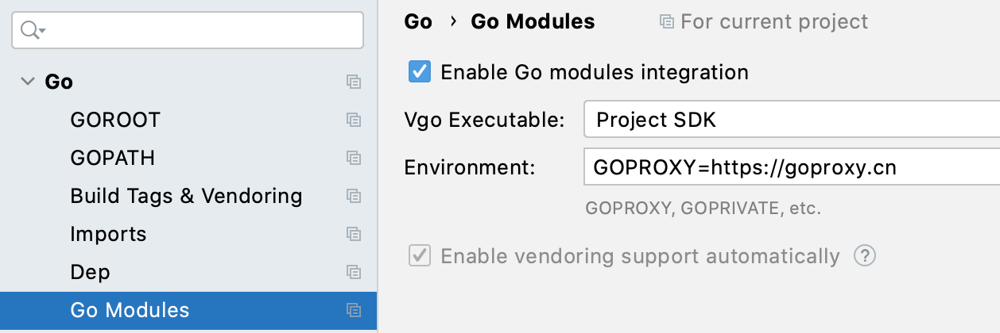

# 安装

## Windows

### 下载

👉[这里](https://golang.org/doc/install) 下载 Go 最新安装包。

安装后，Windows 下打开 cmd 或 powershell，输入 `go version`

```text
PS C:\Users\A> go version
go version go1.15.2 windows/amd64
```

### 配置代理

Go 引用的部分模块需要远程下载，类似 Python 的 pip，Java 的 maven。而 Go 的模块下载地址被墙。这里使用 [GoProxy](https://goproxy.cn/)。

Go 1.13 以上版本可直接

```text
$ go env -w GO111MODULE=on
$ go env -w GOPROXY=https://goproxy.cn,direct
```

使用 GoLand 可更改如下配置



### 安装 Git

Go 安装源代码需要使用以下四种工具之一。这里使用 Git。下载地址 [http://git-scm.com/downloads](http://git-scm.com/downloads)

### 开发工具

推荐 👉 [GoLand](https://www.jetbrains.com/go/) 或 [VsCode](https://code.visualstudio.com/)

### 小试牛刀

```go
package main

import "fmt"
import "rsc.io/quote"

func main() {
	fmt.Println("Hello world")
	fmt.Println(quote.Go())
}
```

以上例子需成功安装 Go 并正确配置代理、Git，运行可看到如下结果。

```text
C:\Users\A\go\src\goStart>go run hello.go
Hello world
Don't communicate by sharing memory, share memory by communicating.
```

